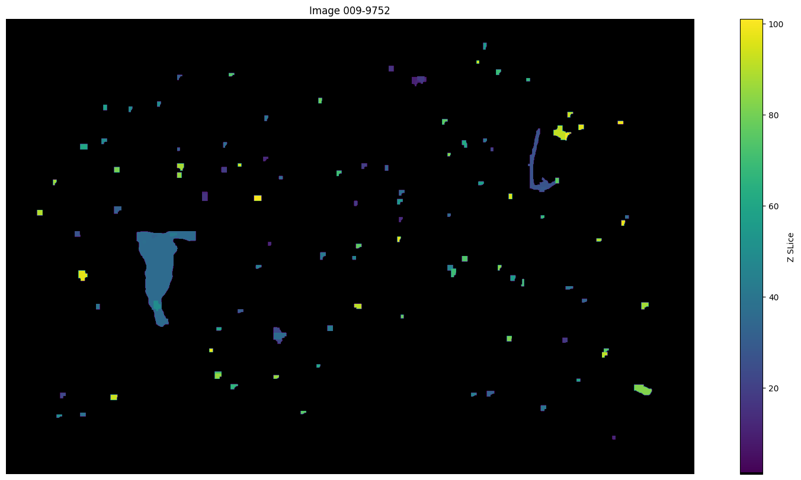
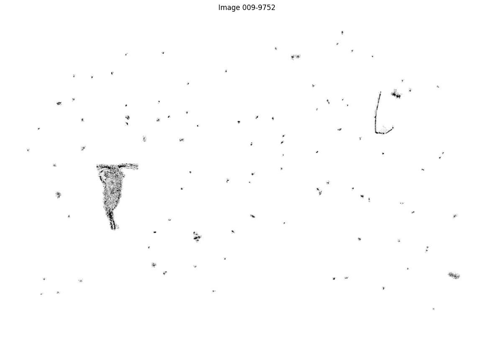

# Plankton Segmentation with Yolo11

The objective of this project was object segmentation throughout the water column of Lake Geneva, located near EPFL. Due to limited domain knowledge, we decided to not classify objects into Living (Planktons), Non-Living or Bubbles. Instead, our main goal was to implement a robust detection and segmentation model capable of identifying objects in the dataset. The segmented entities will then be used by domain experts to properly classify them.

Our research was motivated by the need to improve the existing model used in plankton detection, as its generated images were often inaccurate, leading experts to make errors during analysis.

In order to achieve our goal, Ultralytics YOLO11n model was applied on a large dataset which consisted of .tif images stacked on the depth-axis of the water columns. Each image consists of a slice of the water sample

## Folder Structure

```
.
├── models
│   ├──full                             
│   │   └── best.pt                     # Best model weight for YOLO11 on full images
│   └──patches
│       └── best.pt                     # Best model weight for YOLO11 on patches images
├── src                                 # Source files
│   ├── create_dataset.py
│   ├── create_patch.py
│   ├── evaluate.py
│   ├── load_from_raw.py
│   ├── predict.py
│   └── train.py
├── combined_masks_output_example.png                  # Example output for masks
├── combined_segmentations_output_example.png          # Example output for segmentations
├── visualisation.ipynb                                # Visualization notebook
└── requirements.txt                                   # Python package requirements
```


## Project Setup

Install required packages with :
`pip install -r requirements.txt`

Set up a data folder as following : 
- `mkdir -p data`
- `mkdir -p data/data_raw`
- `mkdir -p data/data_labeled`
- `mkdir -p data/data_split`

In `data/data_raw` create the folder that will store the original .json and .tif as :
- `mkdir -p data/data_raw/geojson_file`
- `mkdir -p data/data_raw/images`

Copy your files to those folders:
- `cp -r path/to/geojson/files data/data_raw/geojson_file/`
- `cp -r path/to/tif/images data/data_raw/images/`

Create a config folder that will store the YAML files to train the YOLO models:
- `mkdir -p configs`

Create a model folder that will store your models weights:
- `mkdir -p models/full`
- `mkdir -p models/patches`

## Prepare Data

For each script, the arguments given are those used to obtain the best performances.

Load the raw data and format it for the task and divide it into two datasets, one for "small" objects and one for "big" objects. Choose the threshold between "small" and "big" objects with the argument "split_value_surface" based on the area of the bounding box of the object:

- `python src/load_from_raw.py --path_geojson "./data/data_raw/geojson_file" --path_images "./data/data_raw/images" --path_output "./data/data_labeled" --min_contrast 0 --max_contrast 255 --split_value_surface 200 --task "seg"`

Then create the dataset:

- `python src/create_dataset.py --path_labeled "./data/data_labeled/ctrst-0-255_srfc-200_prcs-0_seg" --path_split "./data/data_split" --train_ratio 0.7 --val_ratio 0.2 --test_ratio 0.1 --all_slices`

The argument `--all_slices` is used to save all slices from the images in the test set in order to make predictions on all the slice when visualising the results at the end. 

Create the patches needed for the small-objects model:

- `python src/create_patch.py --path_dataset "data/data_split/ctrst-0-255_srfc-200_prcs-0_seg_small_labels" --task "seg" --n_rows_patch 8 --n_cols_patch 8`

Add data augmentations to the training set (needed for training only):

- `python src/augment_dataset.py --path_data_train "data/data_split/ctrst-0-255_srfc-200_prcs-0_seg_small_labels/train" --task "seg"`
- `python src/augment_dataset.py --path_data_train "data/data_split/ctrst-0-255_srfc-200_prcs-0_seg_big_labels/train" --task "seg"`

## Train Models

Run the training script as following:

- `python src/train.py --path_model "models/yolo11n-seg.pt" --name_dataset "ctrst-0-255_srfc-200_prcs-0_seg" --epochs 100 --imgsz_small 190 --imgsz_big 1520 --batch_size 8 --workers 1 --device "0"`

## Evaluate Models

Run the evaluation script as following to know the performance of your model on the test set given the initial annotations:

- `python src/evaluate.py --path_labeled_folder /path/to/original/test/labels --path_model_full /path/to/weights/model/full/image --path_dataset_full /path/to/test/images/full --path_model_patch /path/to/weights/model/patch/image --path_dataset_patch /path/to/test/images/patches --use_patch --n_rows_patch 8 --n_cols_patch 8`

## Predict Segmentation Masks

Run the prediction script as following:

- `python src/predict.py --path_images /path/to/tif/images --path_output_dir /path/to/output --n_rows_patch 8 --n_cols_patch 8 --path_model_full /path/to/weights/model/full/image --path_model_patch /path/to/weights/model/patches --min_contrast 0 --max_contrast 255 --use_patch`

## Visualise Results

If you want an interactive view of the results go to `visualise.ipynb`and adapt the path to your data and models if needed.
The weights to the models are currently saved there:

- small-objects model : `runs/segmentation/yolo11n_ctrst-0-255_srfc-200_prcs-0_seg_small_labels_epochs-100_imgsz-190_batch-8/weights/best.pt`
- big-objects model : `runs/segmentation/yolo11n_ctrst-0-255_srfc-200_prcs-0_seg_big_labels_epochs-100_imgsz-1520_batch-8/weights/best.pt`

### Examples of outputs




## Team Components
For any question and/or curiosity, feel free to reach
* [Martin Louis Le Bras](mailto:martin.lebras@epfl.ch)
* [Valentin Aolaritei](mailto:valentin.aolaritei@epfl.ch)
* [Alberto De Laurentis](mailto:alberto.delaurentis@epfl.ch)
